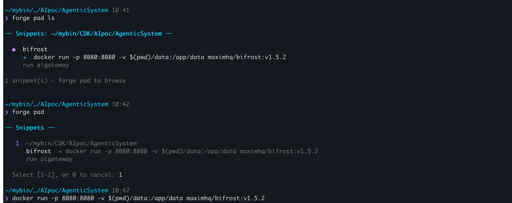

# ⚡ ZshForge

A minimal, fast zsh framework that stays out of your way.

```
forge theme       # pick a theme interactively
forge doctor      # health check
forge bench       # benchmark startup time
j <pattern>       # jump to directories you use often
```

## Philosophy

- **Fast first** — every millisecond counts at shell startup
- **Modular** — only load what you use
- **No magic** — plain zsh, no compilation, no background daemons
- **Growable** — add your own themes and plugins trivially

## Install

```bash
git clone https://github.com/arunksingh16/zshforge ~/.zshforge
cd ~/.zshforge && zsh install.sh
exec zsh
```


## Themes

| Theme | Style |
|-------|-------|
| `nebula` | Colorful two-line prompt with git status, time |
| `oxide` | Minimal single-line, warm rust tones |
| `aurora` | Gradient prompt with system vitals |
| `stealth` | Monochrome, distraction-free |

Switch: `forge theme` (interactive) or `forge theme oxide` (direct)

## Plugins

### history
Fixes all common zsh history annoyances:
- No more duplicates (across sessions)
- Shared history across all iTerm tabs
- Prefix a command with a space to keep it private
- `forge::history::dedup` — clean existing duplicates
- `forge::history::scrub` — remove sensitive entries
- `forge::history::stats` — see your top commands

### dirjump
Fast directory jumping with frecency scoring:
- `j project` — jump to best matching directory
- `j` — interactive picker (uses fzf if available)
- `jl` — list all tracked directories with scores
- `jclean` — remove dead directory entries

### pad
Per-directory command snippet list — store the commands you keep forgetting:
- `forge pad` — browse snippets for the current directory (fzf picker)
- `forge pad -g` — browse all snippets across all directories
- `forge pad add "label" "cmd"` — add a snippet for the current directory
- `forge pad add -g "label" "cmd"` — add a global (dir-independent) snippet
- `forge pad add "label" "cmd" -d "desc"` — add with a short description
- `forge pad rm` — remove a snippet (fzf picker)
- `forge pad ls` — list current directory snippets inline
- `forge pad hint on` — print a dim snippet count when entering a directory

Selected snippets are **pasted to your prompt**, not auto-run — you review before hitting enter.



**Activate:**
```zsh
forge edit   # add "pad" to ZSHFORGE_PLUGINS
exec zsh
```

**Example:**
```zsh
forge pad add "start gateway" "docker run -p 8080:8080 bifrost:latest" -d "AI gateway"
forge pad add "dev server" "npm run dev" -d "port 3000"
forge pad        # open fzf picker, select → command lands on prompt
```

## Add Your Own Theme

Create `~/.zshforge/themes/mytheme.zsh-theme`:

```zsh
setopt PROMPT_SUBST
PROMPT='%F{cyan}%~%f > '
```

Then: `forge theme mytheme`

## Add Your Own Plugin

Create `~/.zshforge/plugins/myplugin/myplugin.plugin.zsh`:

```zsh
# Your plugin code here
```

Add to config: `forge edit` → add `myplugin` to `ZSHFORGE_PLUGINS`

## Structure

```
~/.zshforge/
├── zshforge.zsh          # Main entry (sourced from .zshrc)
├── lib/
│   └── core.zsh          # Shared utilities
├── themes/
│   ├── nebula.zsh-theme
│   ├── oxide.zsh-theme
│   ├── aurora.zsh-theme
│   └── stealth.zsh-theme
├── plugins/
│   ├── history/
│   ├── dirjump/
│   └── pad/
├── bin/
│   └── forge.zsh          # CLI tool
└── install.sh
```

## Config

Stored at `~/.config/zshforge/config.zsh`. Edit with `forge edit`.

## License

MIT
